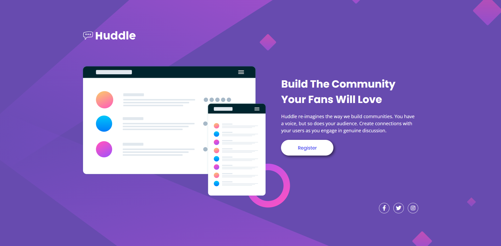

# React Rubkut





<br>


Hubkut combina o design nostálgico do Orkut com funcionalidades da API do GitHub. É um projeto hospedado no GitHub que oferece uma interface familiar para interação social e colaboração em repositórios, promovendo uma experiência única de rede social para desenvolvedores.

<br>

<a href="https://projeto-huddle-base.vercel.app/" target="_blank">🎁CLIQUE AQUI🎁</a> e acesse o deploy do projeto!

<br>

## 💻 Tecnologias usadas
- HTML
- CSS


## 🚀 Como Utilizar

1 - Clone o projeto

```
git clone "https://github.com/ulissesmarciano/projeto-huddle-base.git"
```
2 Acesse a pasta do projeto

```
cd projeto-huddle-base
```

3 Inicializando o projeto


Utilizando a Extensão Live Server pressione Alt+L+O


